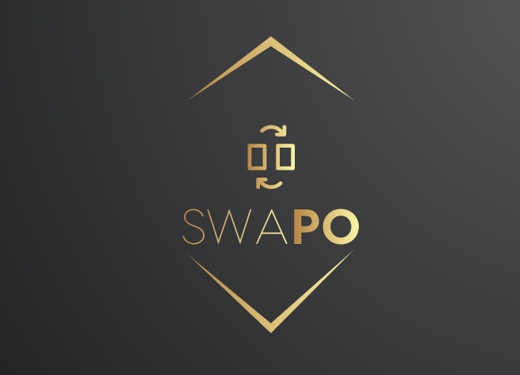
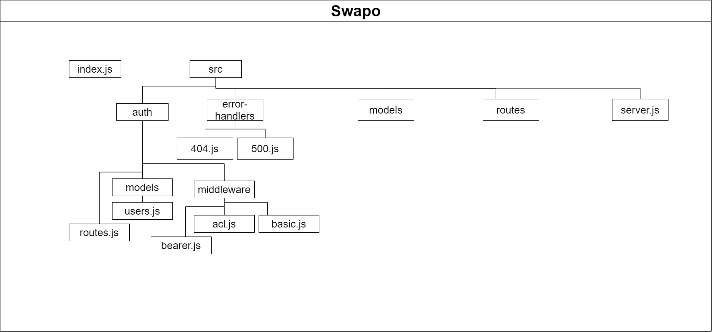
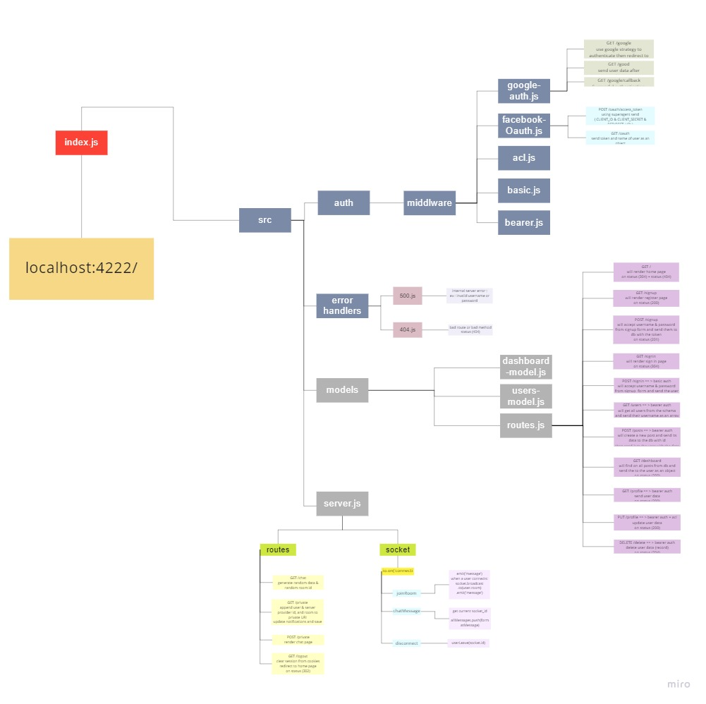

 <h1 >&nbsp;&nbsp;&nbsp;Swapo</h1>

 

## Index

- [Swapo !!](#Swapo-!-!)
- [ASAC/LTUC](#ASAC/LTUC)
- [Code401](#Code401)
- [More about the app](#More-about-the-app)
  - [Authors](#Author)
  - [Tools](#Tools)
  - [Github](#Github)
  - [UML](#UML)
  - [Versions](#Versions)
  - [Deployed app](#Deployed-app)
  - [install and run](#install-and-run)
  - [Tests](#Tests)
- [Authors Links](#Authors-Links)
- [Other links](#Other-links)
  - [Team Agreement](./requirements/team_agreement.md)
  - [Wireframes](./requirements/wireframes.md)
  - [User Stories](./requirements/user_stories.md)
  - [Software Requirements](./requirements/software_requirements.md)
  - [Domain Modeling](./requirements/domain_modeling.md)
  - [Database](./requirements/database_schema.md)

---

## Swapo

- Do you ever need a service? Help? And you need someone who already an expert! I am sure that you do, so what you should do?
- Easy and simple answer to this question! You should use `Swapo`.
- What is `Swapo` ? It is a web app that connects many service providers and those who give their services to each other by swap their knowledge and expertise.

**[⬆ Back to Index](#index)**

---

## ASAC/LTUC

- LTUC’s Abdul Aziz Al Ghurair School of Advanced Computing (ASAC) was inaugurated in 2019 to build the software development and programming skills and capabilities of learners while qualifying them for current and future employment within these fields.

- > for further information, please clicks [here](https://asac.ltuc.com/)

**[⬆ Back to Index](#index)**

---

## **Code401**

- In Code401 (Advanced Software Development) you will discover the latest technologies and tools used by professional software developers and learn more about established industry best practices from around the world – all within an environment that simulates that of major tech companies. In this intensive course, you will study algorithms and data structures and practice software development using advanced systems and programs such as server-side Node.js and client-side React.js. In less than four months, you will be ready to enter the technical job market; switch your career path and bring innovation to software development; or double your salary as a professional developer holding senior positions in tech companies.
- > for further information, please clicks [here](https://asac.ltuc.com/courses/code-401-advanced-software-development/)

**[⬆ Back to Index](#index)**

---

## **More about the app**

---

- ### Authors

  - Shady Khaled 🤓
  - Mostafa Jdeitawi 🤡
  - As-har Abuhelweh ⭐
  - Nour Abu Elenein 🎇
  - Wafa'a Ankoush ✨

  **[⬆ Back to Index](#index)**

---

- ### Tools

  - This app build by 🧰:
    - socket.io
    - Node.js
    - HTML5
    - CSS
    - jQuery
    - Java Script
- This app done with help of
  - dependencies
    - dotenv
    - base-64
    - bcrypt
    - body-parser
    - cookie-session
    - cors
    - ejs
    - express
    - socket.io
    - faker
    - http
    - jest
    - jsonwebtoken
    - method-override
    - moment
    - mongoose
    - morgan
    - multer
    - passport
    - passport-google-oauth20
    - socket.io-client
    - underscore
    - @code-fellows/supergoose

  **[⬆ Back to Index](#index)**

---

- ### Github

  - For the repo 🐱 ***Swapo*** clicks => [here](https://github.com/401d9/SwapoApp).

**[⬆ Back to Index](#index)**

---

- ### UML

  <!-- -  -->
  ### [Click here to show board ](https://miro.com/welcomeonboard/a3hYWkpnRkR4YXFmVzVJcDJZUDRoNVdSNFg5b0dIYVlDRXFybTI5OWdNakczcWFDSDhBdnpkamZZQlVpVkx5bnwzMDc0NDU3MzU3MzU4Mjc2Mjk1)
  - 

**[⬆ Back to Index](#index)**

---

- ### Versions

  - V 1.0.0:
    - The first lunch 🔥 of the app.

**[⬆ Back to Index](#index)**

---

- ### Deployed app

  - It had been deployed on Heroku 😎
    - Visit it [here](https://swapo.herokuapp.com/);

**[⬆ Back to Index](#index)**

---

- ### install and run

  - clone the repo locally
  - run 🏃 `npm install`
  - run 🏃 `nodemon` or `npm start`

**[⬆ Back to Index](#index)**

---

- ### Tests

  - The app had been tested using jest.
  - To run the tests `npm test`.
  - Tests 🧪 :
    - ACL test ➡️ [here](./__tests__/acl.test.js).
    - Basic Auth test ➡️ [here](./__tests__/basic-auth.test.js).
    - Bearer Auth test ➡️ [here](./__tests__/bearer-auth.test.js).
    - Data Base test ➡️ [here](./__tests__/db.test.js).
    - Routes test ➡️ [here](./__tests__/router.test.js).
    - Socket test ➡️ [here](./__tests__/socket.test.js).

**[⬆ Back to Index](#index)**

---

 

## Authors Links

- ### Shady Khaled github ✅

  - [Shady Khaled](https://github.com/shadykh)

- ### Mostafa Jdeitawi github ✅

  - [Mostafa Jdeitawi](https://github.com/jdeitawimostafa)

- ### As-har Abuhelweh  github ✅

  - [As-har Abuhelweh](https://github.com/asharabuhelweh)

- ### Nour Abu Elenein github ✅

  - [Nour Abu Elenein](https://github.com/engnour94)

- ### Wafa'a Ankoush  github ✅

  - [Wafa'a Ankoush](https://github.com/wafaankoush99)
